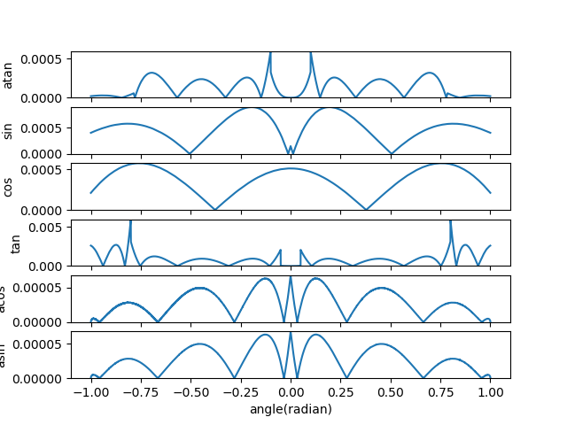

# fast_trigonometry   

## a light weight trigonometry library  

Use curve fitting/ bilinear interpolation to approximate tri function

Average speed up to 2X to tri function in std math.h

* Error ratio



it currently supports

```C
float fast_sin(float x);
float fast_cos(float x);
float fast_tan(float x);
float fast_asin(float x);
float fast_acos(float x);
float fast_atan(float x);
```

## TODO  

[ ] wrap it to library  

